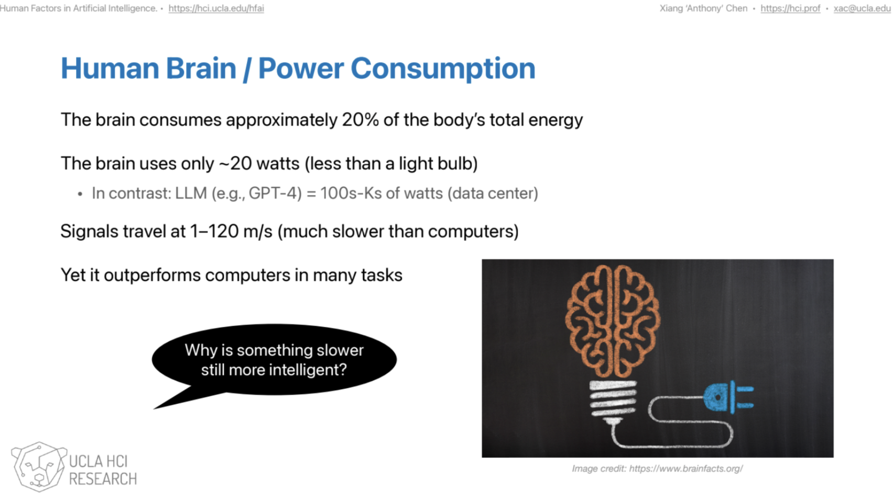

+++
date = '2026-04-02T19:24:03-07:00'
draft = false
title = 'When AI Makes Work Easier, Does It Also Make Waste Easier?'
+++

This quarter, I enrolled in an interesting course called [**Human Factors in Arti–cial Intelligence (ECE 209AS)**](https://docs.google.com/spreadsheets/d/1EPz30ZUIgdEZhgZbZs4WsEvTqstY9_ljpiD0pX9Juh4/edit?gid=0#gid=0). 

One idea from the last course stayed with me: **the human brain may be slower than a computer, but it is dramatically more energy-efficient**. For the average adult at rest, the brain consumes about **20% of the body’s total energy**, yet its total power draw is only about **20 watts**. Neural signals are also much slower than electrical signals in computers. Unmyelinated fibers conduct at about **1 to 5 m/s**, while myelinated axons can reach **up to 150 m/s**. And yet, despite that speed disadvantage, the brain still performs remarkably well in tasks involving judgment, context, adaptation, and meaning.

That idea led me to an uncomfortable question: **what happens when people use AI for work that humans could easily do on their own?** Today, many people ask AI to rewrite short emails, summarize a few paragraphs, generate routine captions, or answer very simple questions. These are tasks that, not long ago, most people would have handled with a few minutes of their own attention. AI makes them easier, but it also makes it easy to forget that convenience is not free.

## The hidden cost of “easy”

Modern AI does not run on nothing. Even if exact public energy numbers for systems like GPT-4 are not available, the infrastructure behind large AI models is clearly energy-intensive. OpenAI notes that proprietary energy benchmarks for frontier models are generally not public, while NVIDIA lists a **DGX H200** system at **about 10.2 kW max system power usage**. At the larger scale, AI infrastructure is pushing toward racks that consume **100 kW or more**, far beyond anything comparable to the human brain.

So the issue is not simply whether AI is useful. Of course it is. AI can help with programming, research, translation, accessibility, large-scale data analysis, and many other demanding tasks. The real issue is whether we are using a high-resource system for **high-value work**, or whether we are normalizing the use of industrial-scale computation for trivial cognitive outsourcing.

## When should humans think, and when should AI help?

I do not think the answer is to reject AI. The better question is: **when should the human brain be used, and when should AI be used?**

The human brain should probably remain the first choice when the task requires:

- judgment
- ethics
- interpretation
- emotional understanding
- common sense
- originality

AI should probably be used when the task requires:

- scale
- repetition
- fast search
- pattern detection
- automation
- processing large amounts of information quickly

That distinction matters because the brain and AI are not optimized for the same things. The brain is astonishingly efficient, flexible, and context-aware. AI is powerful at throughput. Treating them as interchangeable can lead to bad habits: humans start outsourcing even the smallest acts of thinking, while the physical infrastructure needed to support that habit keeps growing.

## Could this speed up resource burnout?

I think the answer is **potentially yes**.

MIT notes that generative AI has real environmental consequences, including rising electricity demand and water consumption for data centers. Those costs do not stop after a model is trained. They continue during everyday use, at inference time, every time people generate text, images, code, or summaries at scale. If more and more ordinary tasks are shifted to AI simply because it is convenient, then resource consumption will grow not only because AI is powerful, but because it becomes the default for everything.

That is what worries me most. If people increasingly use AI just to avoid small amounts of thinking that they are fully capable of doing, then the long-term effect may be a culture of **frictionless waste**. Each individual request may seem small. But billions of “small” requests, multiplied across data centers, become a serious resource question.

## A better way to think about AI

Maybe the point is not that AI is bad, or that humans should do everything manually. The point is that **powerful tools deserve selective use**.

If AI is used for problems that truly require scale, speed, or computational reach, then its energy cost may be justified. But if it is mostly used to avoid ordinary effort, then we should ask whether we are trading away sustainability for convenience.

The irony is that the human brain, despite being slower, may still be the more sustainable everyday intelligence. It runs on about 20 watts. It handles ambiguity well. It understands context. And in many real-life situations, it still knows better than a machine what actually matters.

> Maybe the real question is not whether AI can think for us, but whether every small task is worth asking a data center to think about.

---

## Links

- [BrainFacts: How Much Energy Does the Brain Use?](https://www.brainfacts.org/brain-anatomy-and-function/anatomy/2019/how-much-energy-does-the-brain-use-020119)
- [MIT News: Explained: Generative AI’s Environmental Impact](https://news.mit.edu/2025/explained-generative-ai-environmental-impact-0117)
- [NVIDIA DGX H200](https://www.nvidia.com/en-us/data-center/dgx-h200/)
